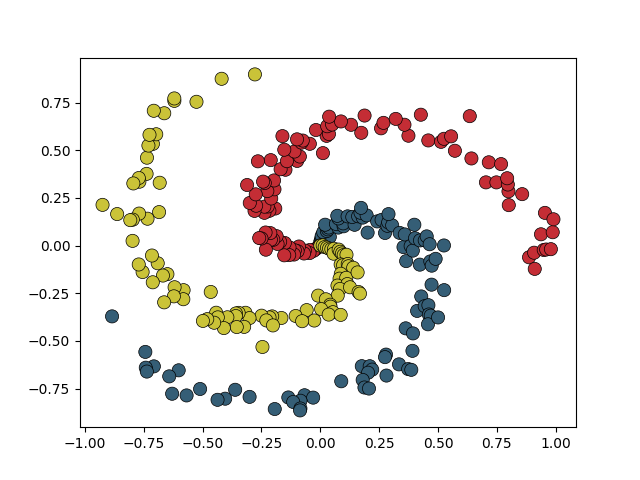
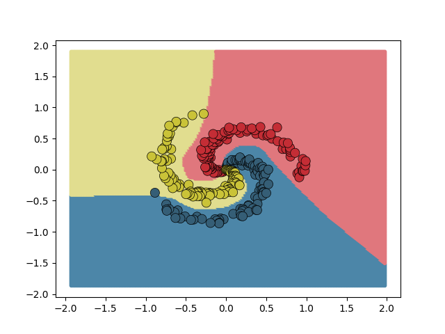

# Planar Data
The goal of this example is to show how you can build and train simple neural networks with
`tensor/nn` module. The task is the following. We've been given a list of 2d points divided into
3 categories. What we need to do is to build a predictive model that would classify all pair points
(x, y) where x and y belong to the range (-2.0, 2.0). The Figure below shows the mapping of given data
into planar space - each category has been given a separate category.



For this task, we use a model build from 2 feed-forward layers with ReLU activation after the first one.
The code is fairly simple so it's better to just show it.
```c++
class Model {
  public:
    using MatrixF = ts::Tensor<float, 2>;
    using VectorI = ts::Tensor<int, 1>;

    auto predict(MatrixF const &inputs) -> VectorI { return ts::argmax(_forward(inputs)); }

    auto update(MatrixF const &inputs, VectorI const &labels, float learning_rate) -> float
    {
        // forward pass
        auto probabilities = _forward(inputs);
        float loss = _loss(probabilities, labels);

        // backward pass
        _layer1.backward(_layer2.backward(_loss.backward(probabilities)));

        // parameters update
        _layer1.update(learning_rate);
        _layer2.update(learning_rate);
        return loss;
    }

  private:
    ts::FeedForward _layer1 = ts::FeedForward(2, 100, true);
    ts::FeedForward _layer2 = ts::FeedForward(100, 3);
    ts::CrossEntropyLoss _loss = ts::CrossEntropyLoss({_layer1.weights(), _layer2.weights()});

    auto _forward(MatrixF const &inputs) -> MatrixF
    {
        auto logits = _layer2(_layer1(inputs));
        return ts::softmax(logits);
    }
};
``` 

### Results
Model is trained until converged and then for each data point we ask it for its prediction.
For details on how this is done in code (quite simply, actually) inspect `main.cpp` file.
The results are shown in the plot below. The lighter colors represented categories predicted by model and 
darken ones the points from the training set.



### How to build
This example is part of the main cmake project so it has to be compiled with it by properly setting
`TENSOR_BUILD_EXAMPLES` flag (This is enabled by default so you wouldn't need to worry about that).
Go to the project root and execute the following in terminal.
```shell script
# Run cmake and compile
cmake -H. -Bcmake-build && cd cmake-build && make -j8 && cd ..
```
### How to run
First, make sure you do have all python dependency listed in `requirements-to-freeze.txt` installed.
Then to reproduce the results execute respectively commands.
```shell script
# Go to the cmake-build/bin 
cd cmake-build/bin
# Show the first figure
./visualize-nn-planar-data 
# Train model and produce results 
./nn-planar-data
# Show the second figure
./visualize-nn-planar-data 
```